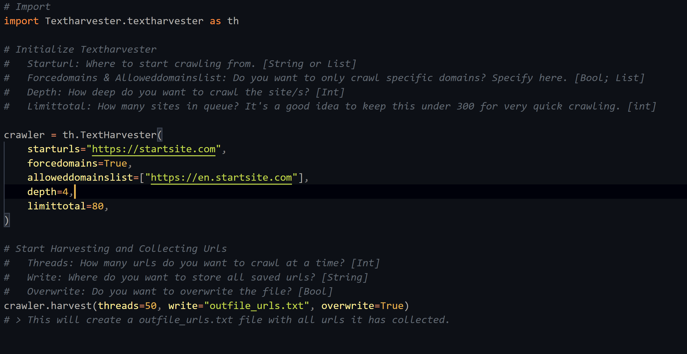
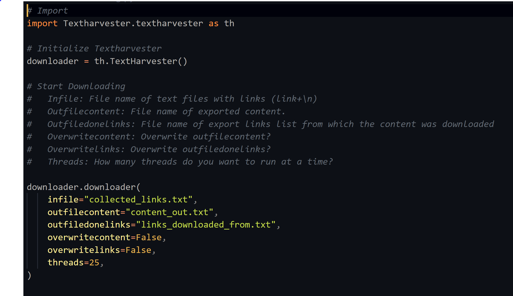

# Textharvester
> A simple tool to collect links and text data from the internet

TextHarvester is an easy-to-use tool for collecting and crawling urls from the Internet and downloading website content from collected urls into a text file. TextHarvester can be used to efficiently collect a lot of text for general purpose nlp.


## Installation

From Source:

```sh
git clone https://github.com/techboy-coder/Textharvester.git
cd Textharvester && pip install --upgrade -r requirements.txt && pip install .
```

## Usage example

### Crawling and Url Collection
In the example below, you can see how to quickly collect links from a website. The links will be saved and can be used later to download the content from each link.



### Download Content
In the example below, you can see how to quickly download content from all collected urls in the form of a text file.



_For more examples and usage, please refer to the Examples Folder._

## Purpose and Ethics

TextHarvester is a great tool to harvest text data. Please feel free to use this tool in your project.
Please Note: I do not take any responsibility for anything you do with this tool.


## Meta

By techboy-coder – (https://github.com/techboy-coder) – 	techboy.coder@gmail.com